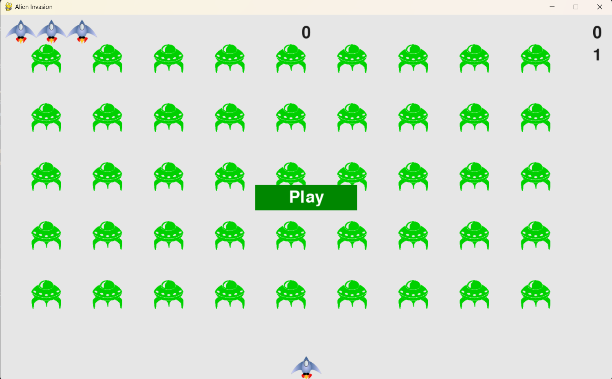

# 👽 AlienGame

Welcome to AlienGame! This is a simple arcade-style game written in Python using the Pygame library. In this game, you'll control a spaceship and navigate through space while avoiding attacks from alien invaders. Your goal is to survive as long as possible and score as many points as you can by shooting down aliens.


## Table of Contents
* [General Info](#general-information)
* [Installation](#installation)
* [How to Play](#how-to-play)
* [Screenshots](#screenshots)
* [Contact](#contact)
* [Author](#author)


## General Information
The purpose of my project is to provide users with a fun and engaging gaming experience. 👽 AlienGame offers a nostalgic arcade vibe where players can test their reflexes and shooting skills while facing off against alien enemies. The concept of AlienGame was inspired by the creative insights found in Eric Matthes' book.


## Installation
To run AlienGame on your local machine, follow these steps:

1. Clone the repository to your local computer:

    ```bash
    git clone https://github.com/spiwik98/Alien_Game
    ```

2. Navigate to the project directory:

    ```bash
    cd AlienGame
    ```

3. Ensure you have Python and Pygame installed. You can install Pygame using pip:

    ```bash
    pip install pygame
    ```


## How to Play
Once you have the game installed, follow these instructions to play:

1. Run the game by executing the `alien_invasion.py` file:

    ```bash
    python alien_invasion.py
    ```

2. Control your spaceship using the arrow keys:
   - Move right: Right arrow key
   - Move left: Left arrow key
   - Shoot: Spacebar

3. Avoid collisions with alien invaders and shoot them down to score points.
   


## Screenshots
#### Homepage

#### Game


## Author
### Wiktoria Spicha👾


## Contact
Find me on LinkedIn: https://www.linkedin.com/in/wiktoria-spicha-junior-it-recruiter/ 
- feel free to contact me!


Enjoy playing 👽 AlienGame! If you encounter any issues or have suggestions for improvement, please don't hesitate to open an issue on GitHub.
